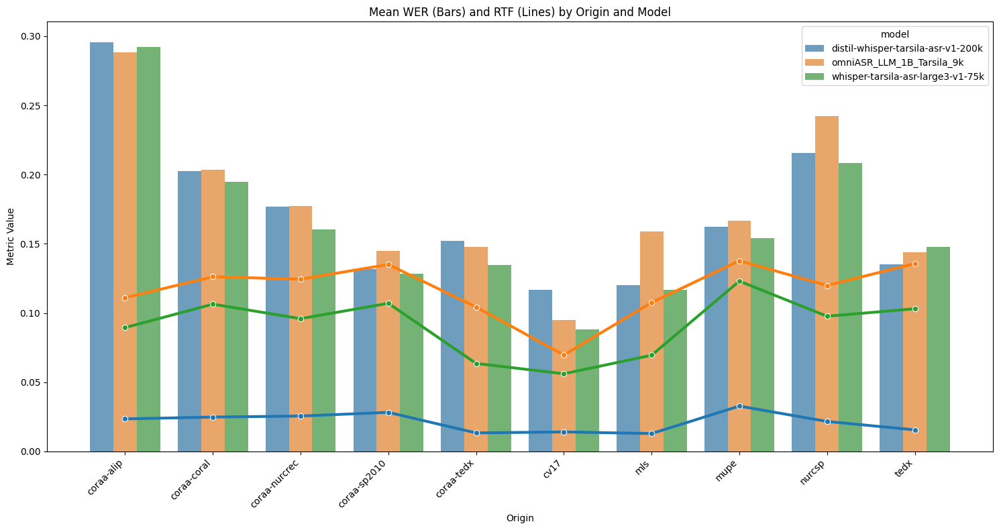
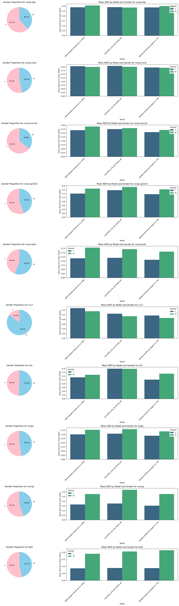

# Tarsila-ASR: A Multi-Domain Test Suite for Benchmarking Brazilian Portuguese Speech Recognition
## Anonymous submission to Interspeech 2026

## Best Models WER vs RTF
This plot shows the Word Error Rate values as bars for each of our three primary models, and also the Real Time Factor values as lines. Although the best WER is achieved with the fine-tuned Whisper-Large, DistilWhisper provides the best tradeoff between accuracy and efficiency.

## Folders description

| Folder | Content |
| :--- | :--- |
| tarsila-asr-dataset | Scripts for building the train/dev/test subsets from public datasets. |
| distil-whisper | Scripts for fine-tuning Distil-Whisper.  |
| whisper-large | Scripts for fine-tuning Whisper Large and Medium.  |
| voice-gender-classifier | Scripts for estimating gender.  |
| h100 | Outputs for eval_all_models.py running in the H100 env.  |
| rtx4070 | Outputs for eval_all_models.py running in the RTX 4070 env.  |

## Huggingface Tarsila-ASR dataset:
Link Omitted for blind review

## Huggingface Models checkpoints:
| Name | link |
| :--- | :--- |
| distil-whisper-ft-asr-200k | Omitted for blind review |
| distil-whisper-ft-asr-750k | Omitted for blind review |
| omniASR_LLM_1B_ft_15k | Omitted for blind review |
| omniASR_LLM_1B_ft_4k | Omitted for blind review |
| omniASR_LLM_1B_ft_9k | Omitted for blind review |
| omniASR_LLM_300M_ft_4k | Omitted for blind review |
| omniASR_LLM_300M_ft_9k | Omitted for blind review |
| whisper-ft-large3-v1-450k | Omitted for blind review |
| whisper-ft-large3-v1-75k | Omitted for blind review |
| whisper-ft-medium-v1-100k | Omitted for blind review |
| whisper-ft-medium-v1-350k | Omitted for blind review |

## Gender analysis

